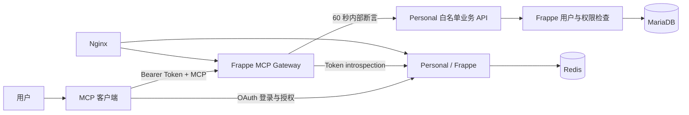

# Personal

基于 Frappe Framework 的个人信息管理系统。

Personal 以“数据属于用户本人”为核心，逐步将健康、饮食及其他个人数据组织成
结构化、可追踪、可授权访问的 Frappe 应用。项目同时提供独立 Docker
部署方案，并通过 Frappe OAuth 与独立的 MCP Gateway 安全连接 AI 客户端。

> A user-owned personal information management application built on Frappe
> Framework.

## 当前功能

### 健康身体指标

`Health Body Metrics` 用于记录：

- 测量时间、体重、身高和自动计算的 BMI；
- 体脂率、脂肪重量和基础代谢；
- 肌肉、蛋白质、身体水分和骨矿物质；
- 骨骼肌重量；
- 数据来源、估算时间标记和 MCP 请求幂等信息。

记录按 owner 隔离。拥有 `Health User` 角色的用户只能读写自己的数据。

### 食物营养

`Health Food Item` 按基础份量保存蛋白质、脂肪、碳水化合物和自动计算的
热量，支持蔬菜、肉类、海鲜、水果、坚果、主食等分类。

### OAuth 授权管理

登录用户可在 `/authorized-apps` 查看已经授权的 OAuth 应用、scope、有效期
和活动会话数量，并撤销指定客户端的全部活动 token。

### MCP 集成

MCP 服务已拆分到独立仓库
[`saoxia/frappe-mcp-gateway`](https://github.com/saoxia/frappe-mcp-gateway)。
Personal 只保留 Frappe 侧的内部断言验证、用户上下文切换、业务 API 和授权
撤销功能。

当前 MCP 工具支持：

- 创建当前用户的健康身体指标；
- 按名称、日期范围或数量查询当前用户可见的身体指标；
- 通过 `client_request_id` 避免客户端重试产生重复记录。

## 架构



Frappe 是唯一身份和授权系统。网关不会建立第二套用户库，也不会把 OAuth
access token 转发给业务 API。详细说明见
[OAuth 与 MCP 集成](docs/oauth-mcp.md)。

## 技术栈

| 组件 | 用途 |
| --- | --- |
| Frappe Framework 16/17 | Web、DocType、权限、OAuth 和业务 API |
| Flow | Personal 的必需 Frappe App |
| Python 3.14 | 应用运行时 |
| MariaDB | 站点业务数据 |
| Redis 7 | Frappe 缓存、队列及断言防重放 |
| Nginx | HTTPS、静态资源及反向代理 |
| Docker Compose | Personal、Redis、Nginx 和 MCP Gateway 编排 |

## 安装到现有 Bench

要求：

- Python `>=3.14,<3.15`；
- Frappe `>=16.0.0-dev,<18.0.0`；
- 已安装 `flow` App。

```sh
cd /path/to/frappe-bench
bench get-app https://github.com/saoxia/frappe-personal.git
bench --site your-site.example install-app personal
bench --site your-site.example migrate
bench build --app personal
```

为需要使用健康模块的用户分配 `Health User` 角色。

## Docker 部署

仓库的 `deploy/` 目录包含生产部署定义：

- `personal`：Frappe/Bench 运行容器；
- `redis`：独立 Redis 容器；
- `nginx`：独立 HTTPS 反向代理；
- `mcp`：从独立 `frappe-mcp-gateway` 仓库构建。

```sh
cd deploy
docker compose config --quiet
docker compose build personal mcp
docker compose up -d
docker compose ps
```

生产部署前请先阅读[部署与运维](docs/deployment.md)，不要直接复用示例域名、密钥
或服务器路径。

## 开发

在 Bench 中运行迁移和构建：

```sh
bench --site your-test-site.localhost migrate
bench build --app personal
```

测试必须在测试站点运行：

```sh
bench --site your-test-site.localhost run-tests --app personal
```

当前测试覆盖 DocType 校验、BMI/热量计算、owner 权限隔离、MCP 写入幂等、
内部断言签名与防重放，以及 OAuth 授权列表和撤销。

## 文档

- [系统架构](docs/architecture.md)
- [健康模块](docs/health.md)
- [OAuth 与 MCP 集成](docs/oauth-mcp.md)
- [开发与测试](docs/development.md)
- [部署与运维](docs/deployment.md)
- [Docker 配置细节](deploy/README.md)

## 项目边界

Personal 当前仍处于持续开发阶段。仓库不会把任意 DocType、SQL 或 Frappe
method 直接开放给 AI。新增 MCP 能力应使用明确的业务工具、最小 scope、
Frappe 原生权限检查和可审计的写入流程。

## License

MIT
